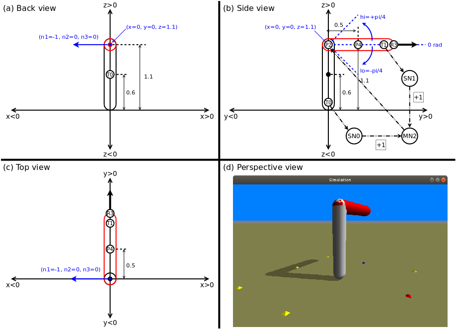

## Ludobots Pyrosim Projects for Evolutionary Robotics Course at UVM -- CS206 Spring of 2017
The contents presented herein comprise source code and work products generated in accordance with the Evolutionary Robotics course taught by Dr. Josh Bongard at the University of Vermont in Spring of 2017, as documented in his YouTube lectures [playlist](https://www.youtube.com/watch?v=4cHHj4l-xuI&list=PLAuiGdPEdw0hbF7EBoTUJbHaEjsxq6oer&t=0s).

A Python 2.7 compatible **pyrosim** package was built and installed on an Ubuntu 18.04 platform from source obtained from the official Pyrosim GitHub [repository](https://github.com/ccappelle/pyrosim) identified [here](https://www.meclab.org/spinoffs). Since this version of **pyrosim** utilizes Open Dynamics Engine (ODE) instead of Bullet Physics, the source code presented for each project may not be relevant for CS206 courses taught after Spring of 2017.

### Reddit links for Ludobots Pyrosim projects

Ludobots Pyrosim project instructions for the CS206 course are provided on Reddit and may be accessed using the following links.

1. [Simulation](https://www.reddit.com/r/ludobots/wiki/pyrosim/simulation)
2. [Objects](https://www.reddit.com/r/ludobots/wiki/pyrosim/objects)
3. [Joints](https://www.reddit.com/r/ludobots/wiki/pyrosim/joints)
4. [Sensors](https://www.reddit.com/r/ludobots/wiki/pyrosim/sensors)
5. [Neurons](https://www.reddit.com/r/ludobots/wiki/pyrosim/neurons)
6. [Synapses](https://www.reddit.com/r/ludobots/wiki/pyrosim/synapses)
7. [Refactoring](https://www.reddit.com/r/ludobots/wiki/pyrosim/refactoring)
8. [Random search](https://www.reddit.com/r/ludobots/wiki/pyrosim/randomsearch)
9. [The hill climber](https://www.reddit.com/r/ludobots/wiki/pyrosim/hillclimber)
10. [The parallel hill climber](https://www.reddit.com/r/ludobots/wiki/pyrosim/parallelhillclimber)
11. [The quadruped](https://www.reddit.com/r/ludobots/wiki/pyrosim/quadruped)
12. [The genetic algorithm](https://www.reddit.com/r/ludobots/wiki/pyrosim/geneticalgorithm)
13. [Phototaxis](https://www.reddit.com/r/ludobots/wiki/pyrosim/phototaxis)

The first seven Ludobots Pyrosim projects involve incrementally designing, developing and simulating the minimal virtual robot depicted in the figure below, then using the minimal robot to demonstrate and evaluate various neural network fitness evolution algorthms such as randoms search and hill climbing.

 

### Project Organization

The above thirteen Ludobots Pyrosim projects are allocated to this repository's subdirectories as denoted in the following list.

  + [simulation](./simulation): project 1  
  + [objects](./objects): project 2  
  + [joints](./joints): project 3  
  + [sensors](./sensors): project 4  
  + [neurons](./neurons): project 5  
  + [synapses](./synapses): project 6  
  + [refactoring](./refactoring): projects 7 & 8  
  + [hillclimbers](./hillclimbers): projects 9 & 10  
  + [quadruped](./quadruped): projects 11 & 12  
  + [phototaxis](./phototaxis): project 13  

In general, each project is allocated to a correspondingly named directory except for random search, the parallel hill climber and genetic algorithm projects. The random search project program extends the refactoring project search program and utilizes the same ROBOT class. The parallel hill climber project program extends the hill climber project program and utilizes the same ROBOT and INDIVIDUAL classes. The genetic algorithm project program extends the quadruped parallel hill climber project program and utilizes the same ROBOT, INDIVIDUAL and POPULATION classes. The configuration of each project source code represents that which generates a project's final work product. For projects with work products demonstrating incremental development of Ludobots Pyrosim virtual robot design features and functional capabilities, the associated program may contain variables to selectively activate the features and capabilities.

### Notes

1. Deliverable work products for most of the CS206 Ludobots Pyrosim projects  include an engineering diagram depicting a notional robot design, and as such the free software diagramming tool [**Dia**](https://wiki.gnome.org/Apps(2f)Dia.html) was used to create engineering diagram PNG image 'eng_drawing.png' files exported from a single 'eng_drawing.dia' worksheet by utilizing **Dia** layering capabilities.
2. For projects with screenshot or graph plot image work products, the associated program incorporates automatic generation of the image when possible.
3. If present, refer to a project's README file for development and execution details not explicitly addressed in the Ludobots Pyrosim project instructions provided at the corresponding Reddit web page (see Reddit links section above).

