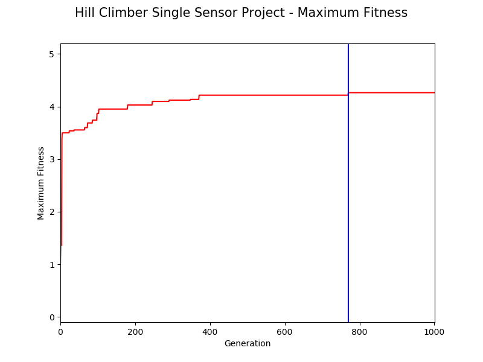
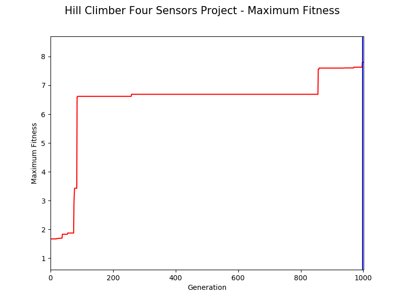

## Hill Climber and Parallel Hill Climber
Single Sensor Neural Network | Four Sensor Neural Network
---------------------------- | --------------------------
 | 

### Pyrosim Project Executables

1. The Python program **hillClimber1.py** simulates a single synapse virtual robot neural network depicted in the engineering diagram image **eng_drawing.png** file (shown above on left) as detailed in Ludobots Pyrosim projects: [Random Search](https://www.reddit.com/r/ludobots/wiki/pyrosim/randomsearch) and [The hill climber](https://www.reddit.com/r/ludobots/wiki/pyrosim/hillclimber).
2. The Python program **hillClimber4.py** simulates a four synapse virtual robot artificial neural network (ANN) depicted in the engineering diagram image **eng_drawing_ANN.png** file (shown above on right) as detailed in steps 1 through 33 of Ludobots Pyrosim project: [The parallel hill climber](https://www.reddit.com/r/ludobots/wiki/pyrosim/parallelhillclimber).
3. The Python program **parallelHillClimber.py** simulates the same four synapse ANN as **hillClimber4.py**, but utilizes the paralled hill climber algorithm detailed in steps 34 through 103 of Ludobots Pyrosim project: [The parallel hill climber](https://www.reddit.com/r/ludobots/wiki/pyrosim/parallelhillclimber).
4. The Python program **playback.py** can load a Python pickle 'robot.p' file output by each of the hill climber programs denoted in items 1, 2 and 3 above.

### Simulation Results

Comparison of fitness landscape plots for 1000 time steps and 1001 iterations of a single sensor virtual robot utilizing the random search and hill climber algorithms is presented in the following figures.

**randomSearch** | **hillClimber1**
---------------- | ----------------
 | 

Comparison of fitness landscape plots for 1000 time steps and 1001 generations of single sensor and four sensor virtual robots utilizing the hill climber algorithm is presented in the following figures.

**hillClimber1** | **hillClimber4**
---------------- | ----------------
 | 

Comparison of maximum fitness plots for 1000 time steps and 1001 generations of single sensor and four sensor virtual robots utilizing the hill climber algorithm is presented in the following figures.

**hillClimber1** | **hillClimber4**
---------------- | ----------------
 | 

Simulation of 1000 time steps of best fitness single sensor and four sensor virtual robots utilizing the hill climber algorithm is presented in YouTube videos hyperlinked to the following images.

**hillClimber1** | **hillClimber4**
---------------- | ----------------
 | 
