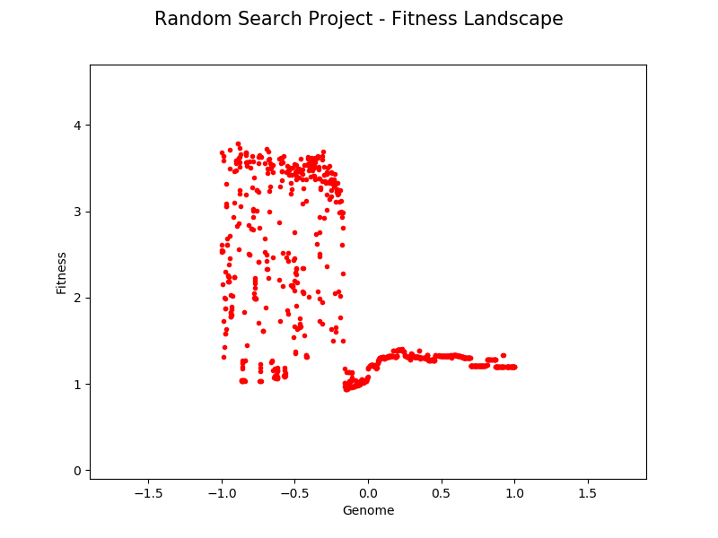

## Hill Climber and Parallel Hill Climber

_|_
|

### Pyrosim Project Executables

1. The Python program **hillclimber1.py** file simulates a single synapse virtual robot neural network depicted in the engineering diagram image **eng_drawing.png** file (shown above on left) as detailed in Ludobots Pyrosim projects: [Random Search](https://www.reddit.com/r/ludobots/wiki/pyrosim/randomsearch) and [The hill climber](https://www.reddit.com/r/ludobots/wiki/pyrosim/hillclimber).
2. The Python program **hillclimber4.py** file simulates a four synapse virtual robot artificial neural network (ANN) depicted in the engineering diagram image **eng_drawing_ANN.png** file (shown above on right) as detailed in steps 1 through 33 of Ludobots Pyrosim project: [The parallel hill climber](https://www.reddit.com/r/ludobots/wiki/pyrosim/parallelhillclimber).
3. The Python program **parallelhillclimber.py** file simulates the same four synapse ANN as **hillclimber4.py**, but utilizes the paralled hill climber algorithm detailed in steps 34 through 103 of Ludobots Pyrosim project: [The parallel hill climber](https://www.reddit.com/r/ludobots/wiki/pyrosim/parallelhillclimber).
4. The Python program **playback.py** file can load a Python pickle 'robot.p' file output by each of the hill climber programs denoted in items 1, 2 and 3 above.

### Notes

Comparison of fitness landscape plots for 1000 time steps and 1001 iterations of a single sensor virtual robot utilizing the random search and hill climber algorithms shown in the following figures.

_|_
|

Comparison of fitness landscape plots for 1000 time steps and 1001 generations of single sensor and four sensor virtual robots utilizing the the hill climber algorithm shown in the following figures.

_|_
|

Comparison of maximum fitness plots for 1000 time steps and 1001 generations of single sensor and four sensor virtual robots utilizing the the hill climber algorithm shown in the following figures.

_|_
|