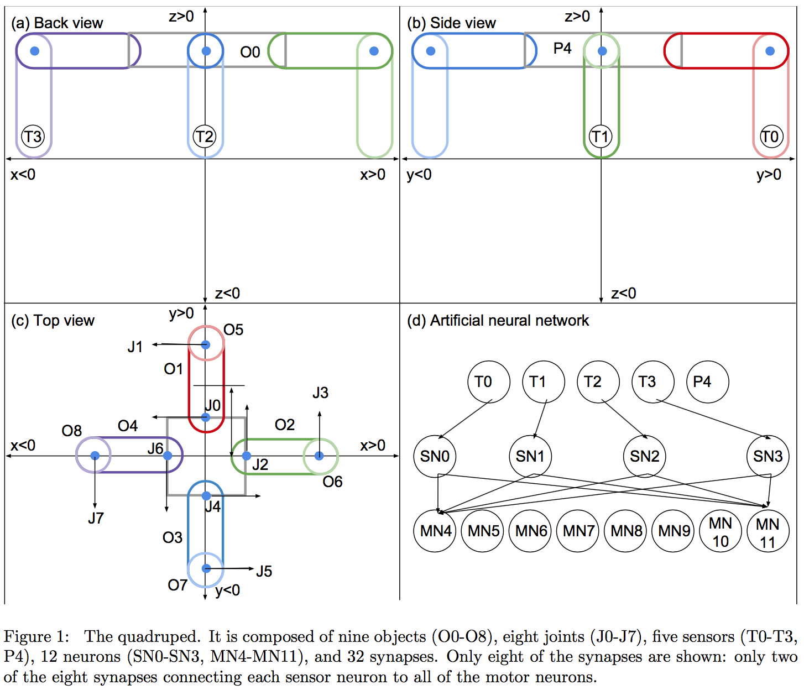
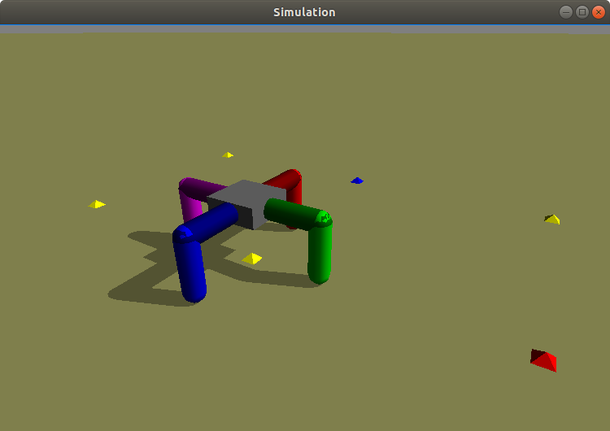
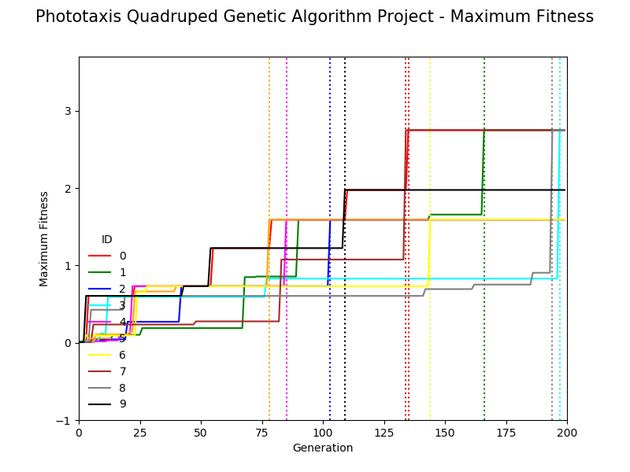
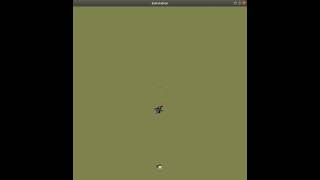
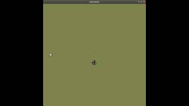

## Phototaxis Quadruped Genetic Algorithm

Engineering Diagram & ANN | Pyrosim Quadruped
------------------------- | -----------------
 | 

### Pyrosim Project Executables

1. The Python program **phototaxisQuadGA.py** simulates a virtual phototaxis quadruped robot with an artificial neural network (ANN) composed of 40 synapses (one from each of four lower leg touch sensor neurons and the body light sensor to each of the eight joint motor neurons) as depicted in the above images, and utilizes the genetic algorithm detailed in the Ludobots Pyrosim project: [Phototaxis](https://www.reddit.com/r/ludobots/wiki/pyrosim/phototaxis).
2. The Python program **playback.py** can load a Python pickle 'robot.p' file output by the phototaxis quadruped genetic algorithm program.

### Simulation Results

Maximum fitness plot for 2000 time steps and 200 generations of the virtual phototaxis quadruped robot utilizing the genetic algorithm is presented in the following figure.

 

Simulations of 2000 time steps for best fitness virtual phototaxis quadruped robot evolved over 200 generations with a genetic algorithm in four light source environments are presented in YouTube videos hyperlinked to the following images.

**Light Source to the Front** | **Light Source to the Right**
----------------------------- | -----------------------------
 | 

**Light Source to the Back** | **Light Source to the Left**
---------------------------- | ----------------------------
 | 
