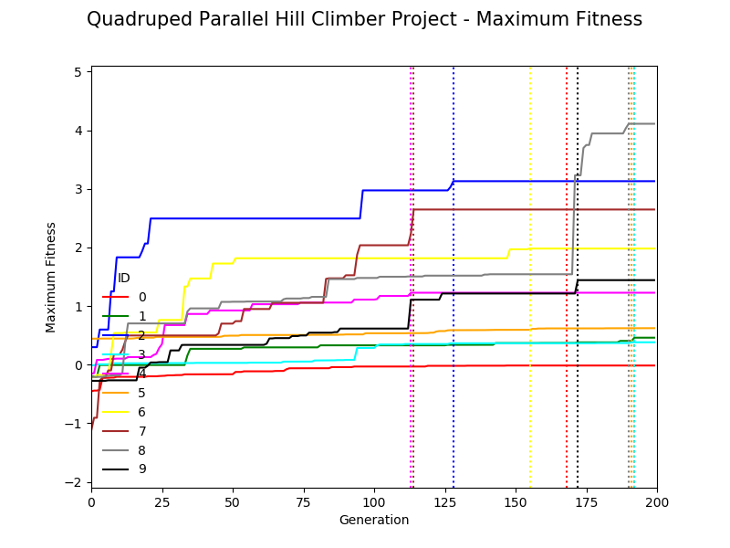

## Quadruped Parallel Hill Climber

Engineering Diagram & ANN | Pyrosim Quadruped
------------------------- | -----------------
 | 

### Pyrosim Project Executables

1. The Python program **parallelHillClimber.py** simulates a virtual quadruped robot with an artificial neural network (ANN) composed of 32 synapses (one from each of four lower leg touch sensor neurons to each of the eight joint motor neurons) as depicted in the above images, and utilizes the paralled hill climber algorithm detailed in the Ludobots Pyrosim project: [The quadruped](https://www.reddit.com/r/ludobots/wiki/pyrosim/quadruped).
2. The Python program **geneticAlgorithm.py** simulates the same virtual quadruped robot and ANN as **parallelHillClimber.py**, but utilizes the genetic algorithm detailed in Pyrosim project: [The genetic algorithm](https://www.reddit.com/r/ludobots/wiki/pyrosim/geneticalgorithm)
3. The Python program **playback.py** can load a Python pickle 'robot.p' file output by the quadruped parallel hill climber and genetic algorithm programs.

### Simulation Results

Comparison of maximum fitness plots for 500 time steps and 200 generations of the virtual quadruped robots utilizing the parallel hill climber and genetic algorithm is presented in the following figures.

**parallelHillClimber** | **geneticAlgorithm**
----------------------- | --------------------
 | 

Simulation of 500 time steps for best fitness virtual quadruped robots evolved over 200 generations with parallel hill climber and genetic algorithm are presented in YouTube videos hyperlinked to the following images.

**parallelHillClimber** | **geneticAlgorithm**
----------------------- | --------------------
 | 
