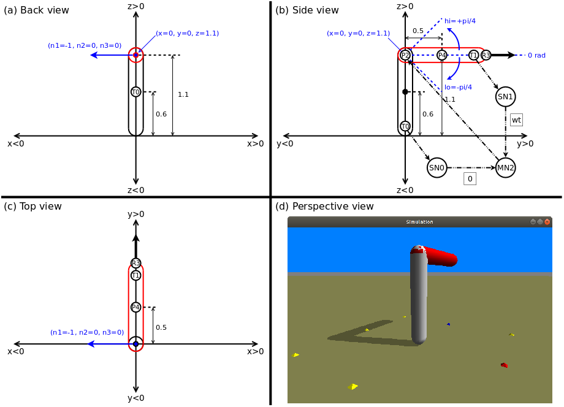

# Refactoring and Random Search

## Pyrosim Project Executables

1. The Python program **search.py** file incorporates a single synapse virtual robot neural network depicted in the engineering diagram image **eng_drawing.png** file (shown above) as detailed in Ludobots Pyrosim project: [Refactoring](https://www.reddit.com/r/ludobots/wiki/pyrosim/refactoring).

2. The Python program **ransomSearch.py** file incorporates the same single synapse virtual robot neural network as **search.py** but utilizes the random search algorithm as detailed in Ludobots Pyrosim project: [Random Search](https://www.reddit.com/r/ludobots/wiki/pyrosim/randomsearch).
